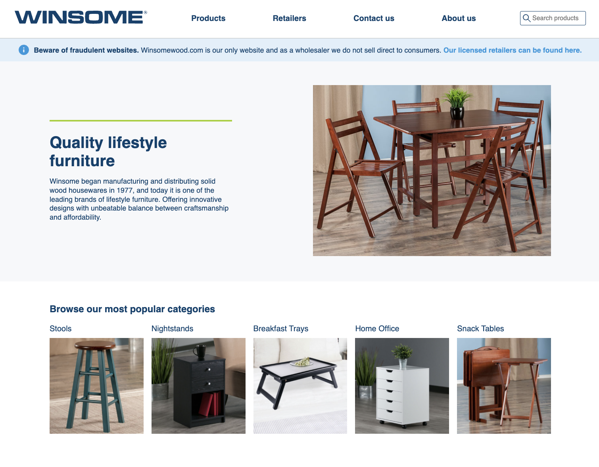

# Features
- Item listings with basic sort & search functionality
- Item => kit associations (a kit is a group of items)
- Contact form and Replacement Item Request form. Both forms send emails on submit
- Admin site to manage items/kits via RailsAdmin
- Basic CMS pages also editable via RailsAdmin

Currently running on Ruby 2.2.0 and Rails 4.2.0. Should eventually upgrade versions but something is up with Ruby dependencies

# Deployment

Server structure and deployment is tricky to improve as-is. For now deployment steps are:

```bash
ssh www.winsomewood.com
sudo su

# as root
ps aux | grep rails # Find and kill old rails s process
kill <pid> # kill old process
cd /root/html
git pull # pull updates
rails s -b <ip_address> -p 80 -e production # start new server
```

# Runbook

View prod Rails log
`tail /root/html/log/production.log`

Postgres commands
`sudo /etc/init.d/postgresql <start|stop|restart>`

Rollbar
https://rollbar.com/GolfinG/winsome-website/
